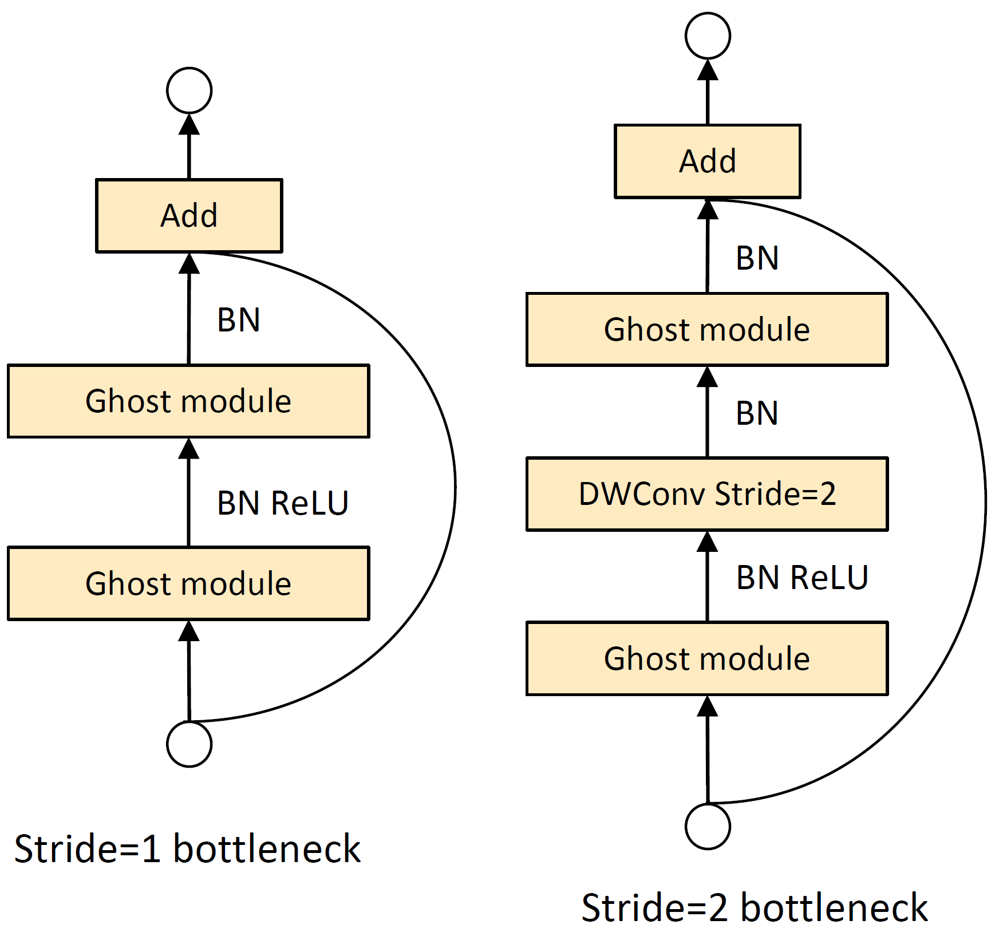
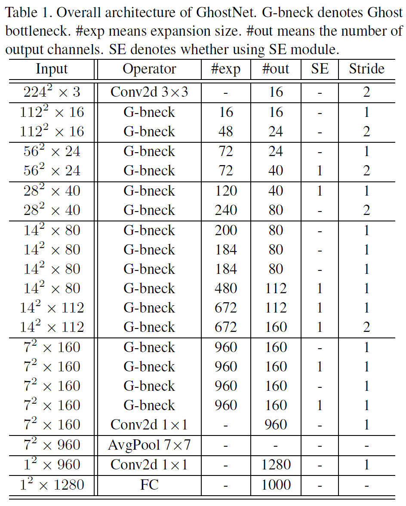

# GhostNet

GhostNet: More Features from Cheap Operations. CVPR 2020. [[arXiv]](https://arxiv.org/abs/1911.11907)

By Kai Han, Yunhe Wang, Qi Tian, Jianyuan Guo, Chunjing Xu, Chang Xu.

## Abstract

Deploying convolutional neural networks (CNNs) on embedded devices is difficult due to the limited memory and computation resources. The redundancy in feature maps is an important characteristic of those successful CNNs, but has rarely been investigated in neural architecture design. This paper proposes a novel Ghost module to generate more feature maps from cheap operations. Based on a set of intrinsic feature maps, we apply a series of linear transformations with cheap cost to generate many ghost feature maps that could fully reveal information underlying intrinsic features. The proposed Ghost module can be taken as a plug-and-play component to upgrade existing convolutional neural networks. Ghost bottlenecks are designed to stack Ghost modules, and then the lightweight GhostNet can be easily established. Experiments conducted on benchmarks demonstrate that the proposed Ghost module is an impressive alternative of convolution layers in baseline models, and our GhostNet can achieve higher recognition performance (e.g. 75.7% top-1 accuracy) than MobileNetV3 with similar computational cost on the ImageNet ILSVRC-2012 classification dataset.

## Code & Models

- TensorFlow version: [https://github.com/huawei-noah/ghostnet/tree/master/tensorflow](https://github.com/huawei-noah/ghostnet/tree/master/tensorflow).

- PyTorch version: [https://github.com/huawei-noah/ghostnet/tree/master/pytorch](https://github.com/huawei-noah/ghostnet/tree/master/pytorch).

## Approach

- **Ghost module**

<div align="center">
   
</div>

- **Ghost bottleneck & GhostNet**

  <div align="center">
     
  </div>

## Experiments

- **Performance**

GhostNet beats other SOTA lightweight CNNs such as **MobileNetV3** and **FBNet**.

<div align="center">
   
</div>

## Citation
```
@inproceedings{ghostnet,
  title={GhostNet: More Features from Cheap Operations},
  author={Han, Kai and Wang, Yunhe and Tian, Qi and Guo, Jianyuan and Xu, Chunjing and Xu, Chang},
  booktitle={CVPR},
  year={2020}
}
```

<a href="#top">Back to top</a>
